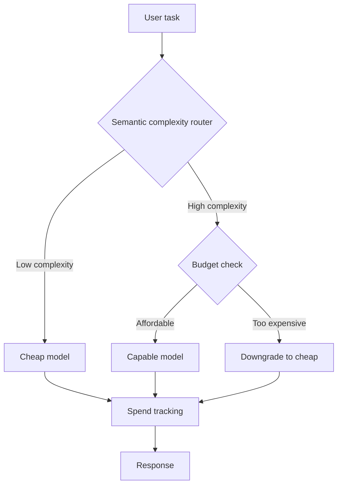

# Baar-Core

**Semantic routing + a hard financial kill-switch for LLM agents.**

Never get surprised by another OpenAI or Anthropic bill.

[](https://badge.fury.io/py/baar-core)
[](https://opensource.org/licenses/MIT)
[](https://www.python.org/downloads/)
[](https://github.com/orvi2014/Baar-Core/blob/main/RESEARCH.md)

```bash
pip install baar-core
```

`baar-core` is the PyPI package name. **Baar-Core** is the project.

---

## Why Baar-Core?

Production LLM agents have a dangerous habit:

- Simple queries still get sent to expensive models.
- One runaway loop turns your **$0.10** budget into **$8+** overnight.
- The invoice lands before you know which step burned the budget.

**Most routers optimize averages. Baar-Core ships a hard Zero-Call Financial Kill-Switch:** enforce a strict USD cap, score complexity, route cheap vs capable — and if the next safe call would exceed what’s left, **reject locally** before a single provider request. **$0 spent. Zero network calls.**

### What you get

- **Smart semantic routing** — Easy work → cheap model; hard work → capable model.
- **Budget-constrained downgrade** — If the big model would break the budget, fall back to the small one so the turn can still finish.
- **True zero-call kill-switch** — Even the cheap model unaffordable? **Fail fast** — no completion call, no surprise line item.
- **Offline Safety** — If your budget is $0, `baar-core` won't even attempt a DNS lookup for the LLM provider. It fails instantly in your local environment.

No surprise invoices. Stronger stance against runaway and adversarial “denial of wallet” patterns. Quality where it matters (reasoning, coding, agents) because hard tasks still reach the capable tier when the budget allows.

---

## How it works



1. **Complexity scoring** — Fast signal for cheap vs expensive route.
2. **Budget-aware choice** — Remaining budget checked before committing to the expensive path.
3. **Local rejection** — Exhausted or unsafe to call? Stop **before** the wire.

---

## Benchmarks

### Mock benchmark (deterministic, calibrated policy)

Command:

```bash
baar-bench \
  --dataset all \
  --limit 200 \
  --budget 10 \
  --mock \
  --value-policy simple \
  --auto-calibrate-alpha \
  --target-reject-rate 0.05 \
  --alpha-source percentile \
  --max-reject-rate 0.5 \
  --small-exploration-rate 0.1 \
  --seed 42
```

| Dataset | Strategy | Accuracy | Total cost | vs always-big |
| :--- | :--- | :---: | :---: | :---: |
| **MMLU** | Always big | 100.0% | $1.990500 | — |
| **MMLU** | **Baar-Core** | **91.5%** | **$1.625000** | **60.9% cheaper** |
| **GSM8K** | Always big | 100.0% | $1.990500 | — |
| **GSM8K** | **Baar-Core** | **90.0%** | **$1.478000** | **60.4% cheaper** |
| **HumanEval** | Always big | 100.0% | $1.630500 | — |
| **HumanEval** | **Baar-Core** | **92.7%** | **$1.369500** | **48.1% cheaper** |

### Live benchmark (small subset sanity check)

Command:

```bash
baar-bench \
  --dataset all \
  --limit 10 \
  --budget 2 \
  --value-policy none \
  --small-exploration-rate 0.0 \
  --seed 42
```

| Dataset | Strategy | Accuracy | Total cost | vs always-big |
| :--- | :--- | :---: | :---: | :---: |
| **MMLU** | Always big | 50.0% | $0.002337 | — |
| **MMLU** | **Baar-Core** | **60.0%** | **$0.000137** | **93.3% cheaper** |
| **GSM8K** | Always big | 60.0% | $0.027615 | — |
| **GSM8K** | **Baar-Core** | **20.0%** | **$0.002097** | **93.3% cheaper** |
| **HumanEval** | Always big | 0.0% | $0.032125 | — |
| **HumanEval** | **Baar-Core** | **0.0%** | **$0.002743** | **93.3% cheaper** |

Live results can vary significantly by provider/model quality, API reliability, and prompt behavior. Use live runs as environment-specific checks, and use mock runs for reproducible routing/cost trade-off iteration.

---

## Quick start

```python
from baar import BAARRouter

router = BAARRouter(budget=0.10)
print(router.chat("What is the capital of France?"))          # → usually cheap model
print(router.chat("Write an optimized CUDA matmul kernel."))  # → capable model if affordable

# Kill-switch: budget too low for any safe call → blocked before the API
tight = BAARRouter(budget=0.00001)
try:
    tight.chat("Any prompt")
except RuntimeError as e:
    print("Blocked safely:", e)  # zero completion calls, $0 spent
```

Works with any LiteLLM-supported provider (OpenAI, Anthropic, Groq, Together, Ollama, OpenRouter, …).

---

## Resilience

```bash
baar-stress
```

Adversarial-style checks (complexity games, tight budget). Baar-Core is designed with **OWASP LLM Top 10** style risks in mind — including unbounded consumption. Details: [RESEARCH.md](https://github.com/orvi2014/Baar-Core/blob/main/RESEARCH.md).

---

## Telemetry Summary CLI

If you enable `telemetry_jsonl_path` on `BAARRouter`, summarize logs with:

```bash
baar-telemetry path/to/telemetry.jsonl
```

This prints reject rate, failover rate, total spend, and per-model spend distribution.

---

## Configuration

Default **`complexity_threshold=0.80`** routes more traffic to the cheap model than `0.65` did; the effective threshold also **rises with budget utilization** so BIG is harder to justify as spend accumulates. Tighten or loosen with `complexity_threshold` if your workload skews very easy or very hard.

```python
router = BAARRouter(
    budget=0.10,
    small_model="gpt-4o-mini",
    big_model="gpt-4o",
    complexity_threshold=0.80,
)
```

---

## License & research

**MIT** — [LICENSE](https://github.com/orvi2014/Baar-Core/blob/main/LICENSE).

Architecture, validation notes, and security mapping: [RESEARCH.md](https://github.com/orvi2014/Baar-Core/blob/main/RESEARCH.md).
