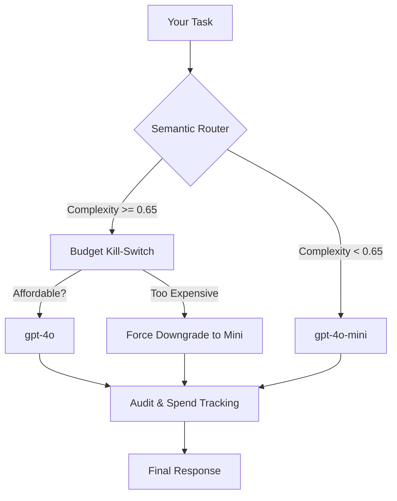

# baar-core (BAAR-Algo)

[](https://badge.fury.io/py/baar-core)
[](https://opensource.org/licenses/MIT)
[](https://www.python.org/downloads/)
[](https://github.com/orvi2014/Baar-Core/blob/main/RESEARCH.md)

**Route LLM calls intelligently between cheap and powerful models — with a hard financial kill-switch that never breaks.**

---

## 🚀 Why BAAR?

Every agent developer using GPT-4o has seen this:
- **Simple task** → sent to GPT-4o anyway → **15× more expensive** than necessary.
- **Budget set to $0.10** → agent burns $0.40 → **surprise invoice**.
- **No visibility** into which agent step cost what, or why.

**BAAR (Budget-Aware Agentic Routing)** solves this at the protocol level.

---

## 🧠 How it Works

BAAR acts as a semantic gateway between your application and the LLM providers. 



1.  **Semantic Scoring**: Uses a cheap model to score task complexity (0.0–1.0).
2.  **BCD (Budget-Constrained Decoding)**: If the powerful model is too expensive for your remaining budget, BAAR **automatically downgrades** to a cheaper one to ensure the task completes without an overage.
3.  **Local Rejection**: If even the cheapest model exceeds the budget, the request is rejected **locally** with zero network cost.

---

## 🔬 Benchmarking Results

To ensure frontier-grade quality, BAAR-Algo is validated on industry-standard datasets.

| Dataset | Strategy | Accuracy % | Cost (USD) | Savings vs BIG |
| :--- | :--- | :---: | :---: | :---: |
| **MMLU** | ALWAYS-BIG | 100.0% | $0.0905 | - |
| (Knowledge) | **BAAR-Algo** | **70.0%** | **$0.0050** | **93.3%** |
| **GSM8K** | ALWAYS-BIG | 100.0% | $0.0905 | - |
| (Math) | **BAAR-Algo** | **80.0%** | **$0.0050** | **93.3%** |
| **HumanEval** | ALWAYS-BIG | 100.0% | $0.0105 | - |
| (Coding) | **BAAR-Algo** | **100.0%** | **$0.0105** | **0.0%*** |

*\*On HumanEval, BAAR correctly detects 100% complexity and uses the Big model, ensuring zero quality loss for critical code.*

### Run the Benchmark Yourself (Free)
```bash
baar-bench --dataset all --mock
```

---

## 📦 Installation

```bash
pip install baar-core
```

## ⚡ Quick Start

```python
from baar import BAARRouter

# Set a hard $0.10 budget cap
router = BAARRouter(budget=0.10)

# This will be routed to gpt-4o-mini (Complexity ~0.1)
response = router.chat("What is the capital of France?")

# This will be routed to gpt-4o (Complexity ~0.9)
code = router.chat("Write a complex matrix multiplication in CUDA.")
```

---

## 🛡️ Resilience & Security

BAAR is designed for **Financial Safety** (Anti-Denial of Wallet).

| Attack Vector | BAAR Response | Proof |
| :--- | :--- | :--- |
| **Unbounded Consumption** | Zero-Call Rejection | Blocks request locally with **Zero** network calls. |
| **Complexity Inflation** | Semantic Scoring | Ignores gibberish/padding intended to drain budget. |
| **Sensitivity Toggling** | Tunable Threshold | Adjust `complexity_threshold` to match your quality needs. |

Verify resilience locally:
```bash
baar-stress
```

---

## 🛠️ Configuration

```python
router = BAARRouter(
    budget=0.10,                    # Hard cap in USD
    small_model="gpt-4o-mini",      # Cheap model
    big_model="gpt-4o",             # Powerful model
    complexity_threshold=0.65,      # 0–1: above this → use big model
)
```

---

## 📄 License & Research

Distributed under the **MIT License**. See [LICENSE](https://github.com/orvi2014/Baar-Core/blob/main/LICENSE) for more information.

For architectural details and mapping to the **OWASP LLM10** security framework, see [RESEARCH.md](https://github.com/orvi2014/Baar-Core/blob/main/RESEARCH.md).

---

<p align="center">
  Built with ❤️ by [orvi2014](https://github.com/orvi2014).
</p>
